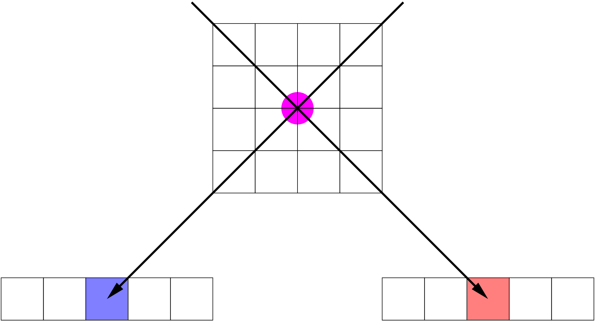
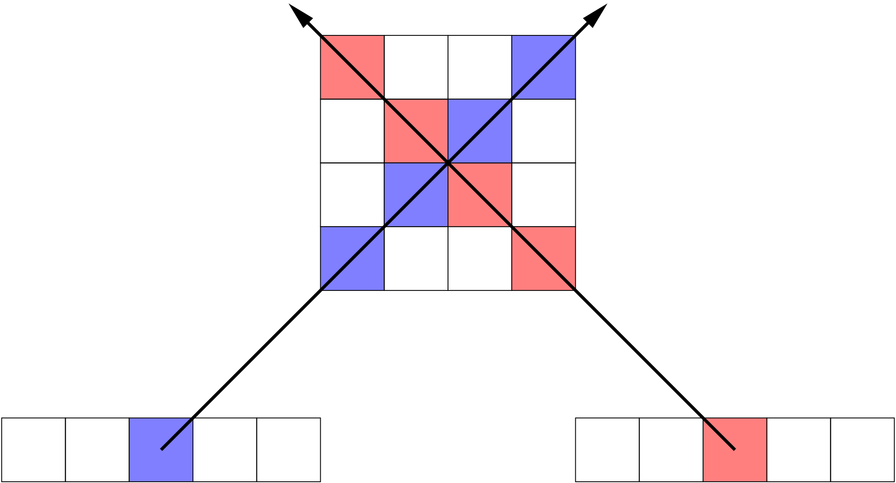
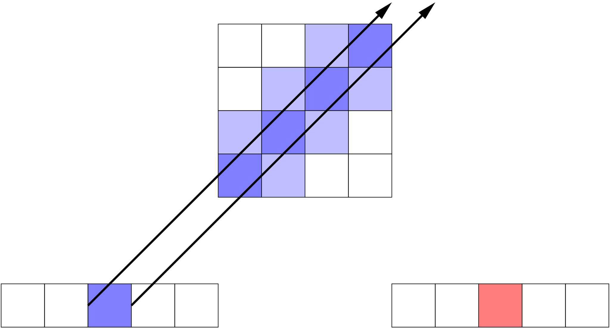
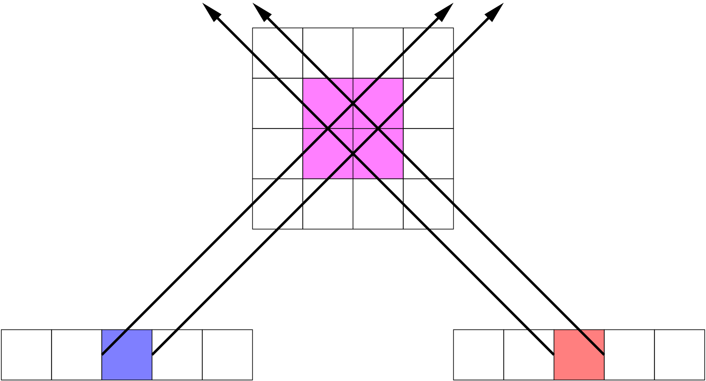

Analogy to Richardson-Lucy
==========================

I am attempting to gain insight into MART by making an analogy to
`Richardson-Lucy deconvolution <https://en.wikipedia.org/wiki/Richardson–Lucy_deconvolution>`_ ,
henceforth RL.

(De)Convolution
---------------

Consider the deconvolution problem, which is to solve the following equation for :math:`\hat{u}`:

.. math::
    :label: deconvolution-problem

    d = \hat{u} \otimes P.

:math:`\hat{u}` is the distribution of intensity in the sky plane,
:math:`\otimes` is the convolution operator,
:math:`P` is the blurring caused by the instrument,
and :math:`d` is the data (an image recorded by an instrument).
RL estimates :math:`\hat{u}` by an iterative procedure described by the equation below.

.. math::
    :label: rl-iteration

    \hat{u}^{(t+1)} = \hat{u}^{(t)}\cdot
        \left( \frac{d}{\hat{u}^{(t)} \otimes P}
               \otimes P^{\ast} \right)

I have used the same notation as the Wikipedia article,
where :math:`\hat{u}^{(t)}` is the :math:`t^{\text{th}}` estimate of :math:`\hat{u}`.
The dot denotes an ordinary scalar product of two functions.
In practice, we need an initial guess to get the iteration started.
One could start from a flat distribution.
A common choice is to begin from the data image,

.. math::
    :label: guess

    \hat{u}^{0} = d.

The ratio in the iteration formula makes intuitive sense as a correction factor.
Assuming that :math:`\hat{u} \otimes P` does not match :math:`d`,
this multiplicative correction brightens the pixels of :math:`\hat{u}` that are too dim and dims the pixels that are too bright.
In the limit :math:`\hat{u} \otimes P \rightarrow d`,
the correction factor goes to unity (note that convergence is assumed, not proven!),
and all the correction factors go to unity.
This reminds me of the corrections we apply with MART.

The Flipped PSF
---------------

Now look at the rightmost factor in the RL iteration, :math:`P^{\ast}`, which is the flipped PSF.
`Why is that there?`
I see at least three ways to understand this factor:

#. Back-projection from the data space to the solution space.
#. Accounting for PSF asymmetries.
#. Finding a maximum likelihood solution.

We are used to thinking of the data :math:`d` and the original image :math:`\hat{u}` as living in the same space.
Point (1) indicates that is not necessarily true.
They could be sampled at a different pixel size, for instance, which would make :math:`P`
(or rather, the convolution with :math:`P` )
a rectangular matrix rather than square.
Physically, the units may also differ: radiometric units for :math:`\hat{u}`, data numbers for :math:`d` .

But what about the spatial extent of the PSF?
Wouldn't :math:`P^{\ast}` have the same width as :math:`P`,
and so wouldn't the corrections be blurred?
Mightn't this prevent us from sharpening the blurry image :math:`d`?
Before getting into more detail, let me point out that a blurry correction multiplied iteratively will tend to sharpen.
So the worry I have just stated may (and in fact, does) turn out to be unfounded.
So, with that intuitive introduction,
let's consider more carefully whether distribution of the correction factors in space according to :math:`P^{\ast}` makes sense.

If you have worked with measured or modeled PSFs, you may have tried to center the a distribution at the origin.
And then you may have wondered what centered means for a PSF that's not symmetric;
for example, do we place the centroid or the peak at the origin, or something else?
Bearing this in mind, consider a PSF that shifts the image :math:`\hat{u}` to the right.
It's just an off-centered delta function, which makes it easy to visualize the convolution and deconvolution without doing math.
Now suppose that our initial guess is :math:`d`, as anticipated above.
If we simply treat the image and skyplane spaces as identical and leave out :math:`P^{\ast}`, what happens?
It will be easiest to imagine this if :math:`\hat{u}` is considered as an image with a star at the origin.
:math:`d` is then an image of the star shifted one step to the right.
On the first iteration, the denominator of the correction factor is a delta function (e.g., image of a star) shifted *two* steps to the right.
Taking the ratio gives us a correction factor that wants take intensity from a location two steps to the right and place it at a location one step to the right.
That is not a helpful correction.
But when we convolve with the flipped PSF, the correction factor is properly aligned to shift the star image in :math:`d` back to the origin.
The apparent purpose of :math:`P^{\ast}` is to apply the correction factor `in the right place.` That explains point (2).

My first two points offer selective glimpses at why the convolution with :math:`P^{\ast}` is required,
but they don't get to the heart of the matter.
*Even if the data and image spaces are the same, and the PSF is symmetric, RL does not work without the*  :math:`\otimes P^{\ast}`.
Yes, I've tried.
Point (3) relates to the original Bayesian derivation of the method by :cite:t:`Richardson1972`,
and independently by :cite:t:`Lucy1974`.
They showed that *if* the method converges, it gives a maximum likelihood estimate for :math:`\hat{u}`.
The interpretation of the :math:`\otimes P^{\ast}` operator is crucial here.
**For each element of** :math:`\boldsymbol{\hat{u}}`,
**the convolution with** :math:`\boldsymbol{P^{\ast}}` **quantifies the likelihood that its source lies in a given element of** :math:`\boldsymbol{d}`.
More on this later.

Tomography and MART
-------------------

For MART, point (1) comes to the fore.
:math:`P` would be a projection operator,
projecting the :math:`x,y,\lambda` cube to an image in the skyplane :math:`x,y`,
or rather into a detector plane that has different sampling and perhaps some distortion.
Hence, :math:`P^{\ast}` *corresponds to the back-projection whereby we extrude the 2D correction factors through the cube.*

I'm also intrigued by the original deconvolution application,
in which PSF :math:`P` and its flipped version :math:`P^{\ast}` have equal width;
that is, the transformation of the correction factor from data space back to the skyplane has inherent blurring in the RL algorithm.
That blurring turns out to be well-motivated.
We found in the deconvolution case that :math:`P^{\ast}` *shifts the correction to the right spot* (point 2);
and that this has a deeper significance in a maximum-likelihood context.

I think :math:`P^{\ast}` in RL clarifies at least three things for MART:

#. It's not necessarily a problem that interpolation during back-projection causes some blurring. In fact, if a PSF were included in our model, the RL formula would tell us to include a flipped version of it in our back-projection.
#. The back-projection should correct the :math:`x,y,\lambda` cube *in the right place*: that is, only where we have a valid correction factor. A null correction (no change) is unity, which by no coincidence is the default replacement for :obj:`numpy.nan` in :func:`numpy.nanprod`.
#. Thinking in terms of likelihoods, the backprojection from :math:`d_i` to :math:`\hat{u}^t_j` must include something like

.. math::
    :label: likelihoods

    \Pr(\hat{u}^t_j|d_i) = \frac{\Pr(d_i|\hat{u}^t_j) \Pr(\hat{u}^t_j)}{\Pr(d_i)}.

The second point bears on `MEADOS Issue #1 <https://github.com/jacobdparker/meados/issues/1>`_.
And there may be more to learn here from the analogy of MART to RL: boundary effects in RL has been addressed by :cite:t:`Bertero2005`.

Point three is illustrated by the *bishops’ sampling problem,*
illustrated in the following sequence of figures.
Like the black and white bishops in chess, diagonal projections can miss each other.
*Backprojection must take into account the full range of cells from which a given data pixel may have arisen.*
The sequence illustrates projection,
failed correction (in which the bishops miss each other despite intersecting paths),
careful backprojection, and finally, accurate correction.

    Projection of an object (magenta spot) that isn't aligned with the voxel grid of :math:`\hat{u}` can nevertheless lead to single-pixel spikes in :math:`d`.

    If we backproject naively, like the movement of the bishop on a chess board, *the paths of projection intersect, yet fail to overlap*.
    Once the corrections are multiplied, no source is found in :math:`\hat{u}`.
    In the absence of any background intensity, we just get zeros everywhere!
    If there is a flat background, we'll get a plaid pattern, but the intensity is no higher in the neighborhood of the intersection of diagonal plaid elements.

    Instead, suppose we project the boundaries of a spike back through the :math:`\hat{u}` space.
    We find strong overlap with the pixels along the bishop's path, but weaker overlap for the nearest neighbors.
    Hence, when we interpolate the correction in the volume, we should weight the off-diagonal pixels accordingly.

    When projections of the right sort are applied, the source is found (magenta box).

Bottom Line
-----------

Some of the points above are a bit vague and qualitative,
but my recommendation for the actual application (for RL, MART, and any other analogous use case) is extremely simple.

1. Formulate the forward model :math:`P` not as a convolution or a projection, but as a sparse matrix:

.. math::
    :label: forward-model

    d = P \hat{u}.

This forward model can incorporate not only blurring and/or projection, but optical distortions and coordinate changes as needed.
**Positivity and conservation of photons (or any invariant of the forward model) are of paramount importance in formulating** :math:`\boldsymbol{P}`.

2. The backprojection is then merely the transpose, :math:`P^T`, so the RL analogue for any inversion is simply

.. math::
    :label: update-rule

    \hat{u}^{(t+1)} = \hat{u}^{(t)}\cdot
        P^T\left( \frac{d}{P \hat{u}^{(t)} }
                \right),

where the product represented by the dot is scalar element-by-element multiplication such as one would find in Numpy (``*``) or Matlab (``.*``).

For tomography, MART gains much of its power from excluding intensity along differing points of view.
Therefore, it is important to calculate the correction factors separately for each data image :math:`d^k`:

.. math::
    :label: result

    d^k = P_k \hat{u}; \quad \boxed{
    \hat{u}^{(t+1)} = \hat{u}^{(t)}\cdot \prod_k
        P_k^T\left( \frac{d^k}{P_k \hat{u}^{(t)} }
                \right) }
