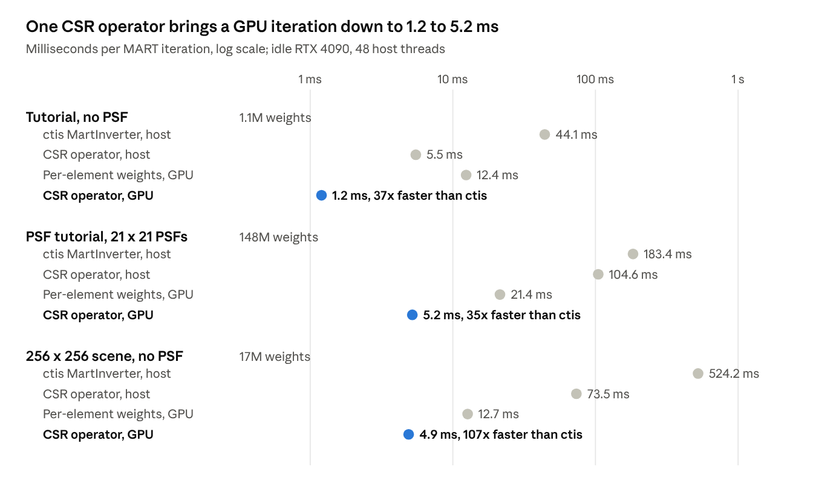
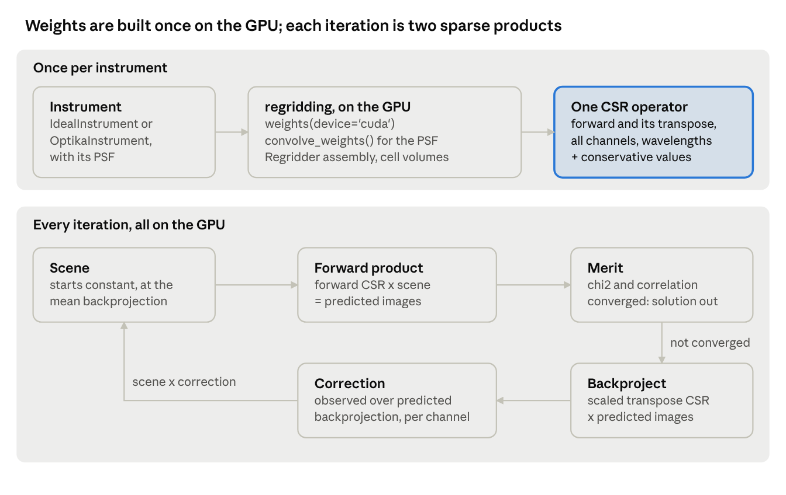
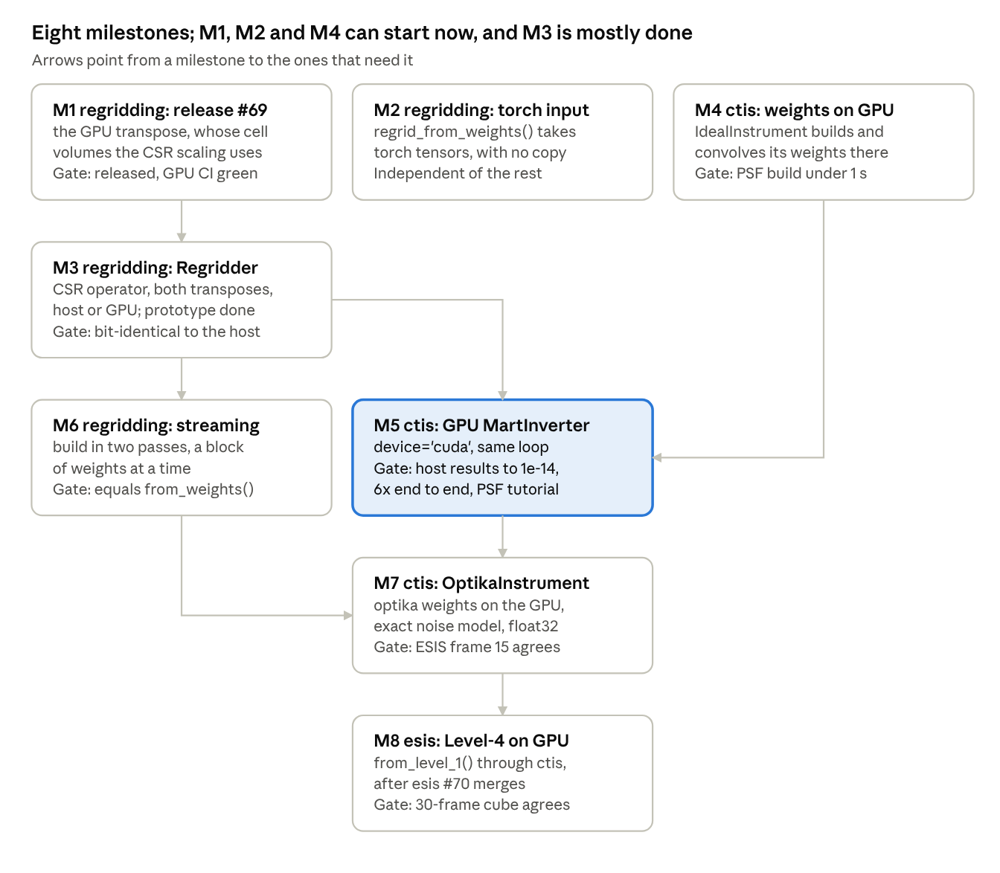

CUDA MART Roadmap
=================

*As of 2026-10-06.*

Every numerical piece of a CUDA implementation of MART now exists,
and a prototype ``regridding.Regridder`` joins most of them:
one sparse CSR operator with both of its transposes, assembled on the GPU.
What remains is a GPU path in :class:`~ctis.inverters.MartInverter`,
and a streaming build for weights too large to hold at once,
which the ESIS Level-4 product needs.

Where things stand
------------------

.. list-table::
    :header-rows: 1
    :widths: 22 22 18 38

    * - Piece
      - Where
      - Status
      - What it gives a CUDA MART
    * - Device weights, ``regridding.weights(device="cuda")``
      - regridding
      - Released
      - Conservative weights built on the GPU;
        the output grid must be a uniform, axis-aligned lattice
    * - ``regridding.convolve_weights()`` on the device
      - regridding 3.5.0
      - Released
      - A PSF folded into the weights without leaving the GPU
    * - ``regridding.regrid_from_weights()`` on the device
      - regridding
      - Released
      - Applies device weights, one kernel launch per orthogonal element;
        rejects :mod:`torch` tensors
    * - ``regridding.transpose_weights_conservative()`` on the device
      - `regridding #69 <https://github.com/sun-data/regridding/pull/69>`__
      - Open, CI green, four review rounds
      - Conservative transposes of device weights;
        its per-grid cell volumes give the CSR operator its conservative scaling
    * - ``regridding.Regridder``
      - regridding ``feature/regridder``, built on #69
      - Prototype, not yet in a pull request, 67 tests
      - Every channel and wavelength in one CSR matrix,
        with broadcasting declared by shapes, exact and conservative transposes,
        and assembly on the host or GPU that agree bit for bit
    * - :class:`~ctis.inverters.MartInverter`
      - ctis 0.5.0
      - Released
      - The reference algorithm, on the host through :mod:`named_arrays`,
        with PSF support in :class:`~ctis.instruments.IdealInstrument`
    * - :mod:`torch` ``Regridder``
      - ctis ``feature/parametric-inverter``, ``feature/elastic-net-inverter``
      - Unmerged
      - Weights as one CSR matrix with an explicit transpose, deterministic on CUDA;
        the regridding prototype generalizes it
    * - Level-4 GPU MART scripts
      - esis ``wip/level4-tempest-tooling``
      - Unmerged scripts
      - The production run: 30 frames in about 10 minutes on one H100,
        from CPU-built weights
    * - MART benchmarks
      - Local scripts
      - Throwaway
      - The MART loop of :class:`~ctis.inverters.MartInverter` on raw :mod:`torch`
        tensors, with per-element device weights and with the CSR operator;
        both match ctis to 1e-14

What we learned
---------------

One CSR operator makes a MART iteration on the GPU 35 to 107 times faster than ctis,
and 2.6 to 10 times faster than the per-element GPU path,
by replacing 160 kernel launches with two.
On the host alone it is 1.8 to 8 times faster than ctis.

    Milliseconds per MART iteration on an idle RTX 4090 and 48 host threads,
    for the tutorial, the PSF tutorial with 21 by 21 PSFs, and a 256 by 256 scene.
    Every implementation matched ctis to 1e-10 or better.

- **Launches dominate the GPU.**
  ``regrid_from_weights()`` launches one kernel per channel and wavelength,
  80 per regrid here, costing about 11 ms an iteration.
  The tempest scripts (one flat table per channel and ``index_add_``)
  and the :mod:`torch` ``Regridder`` (one CSR matrix) both avoid this.
- **Setup now dominates short runs.**
  On the PSF tutorial the CSR GPU path spends 2.3 s building its operators
  and 0.25 s iterating,
  so end to end it is 4.2 times faster than ctis,
  against 6.3 for the per-element path.
  Building the backprojection straight from the weights would remove
  one of its three assemblies and the transpose.
- **Short rows waste the GPU kernel.**
  It gives each row a 32-thread warp,
  but the rows of the backprojection hold about 3 entries each.
  That is why the sparse product of :mod:`torch` (cuSPARSE) beats it on the 256 by 256 scene,
  2.0 ms against 4.9.
  The backprojection rows of ESIS average 3.5 entries,
  so the kernel needs fewer threads per short row before M5.
- **Assembly is cheap once parallel.**
  At 145M weights, assembling takes about 0.5 s on the GPU and on 48 host threads alike,
  and the transpose another 0.5 s.
  The host and GPU build the same matrix bit for bit.
- **Half of the host time of ctis is not regridding.**
  The same algorithm on raw :mod:`numpy` arrays takes 16 ms instead of 44,
  and 247 instead of 498.
  The rest is :mod:`named_arrays` and :mod:`astropy` overhead:
  units, uncertain arrays, the residual correlation.
- **Building the weights is the expensive step at production scale.**
  Tempest needed about 1.3 TB of cached CPU weights and 1.2 TB jobs per frame.
  Built on the GPU, the 148M weights of the PSF tutorial take 0.74 s instead of 2.5 s.
- **MART needs the conservative transpose, which is a scaled exact one.**
  The adjoint of the :mod:`torch` ``Regridder`` is the exact transpose,
  but the backprojection of MART must conserve flux.
  That is the exact transpose with each entry scaled by an input-cell factor
  over an output-cell volume, so both share one set of indices.
- **Atomic adds are not deterministic.**
  The device scatter adds in no fixed order,
  and the ratios of MART amplified that to 1e-10 where both sides are near zero.
  CSR gives identical results every run.
- **Precision and memory trade off.**
  Tempest stored values as float32 and indices as int32
  to fit the production grid on one 80 GB GPU.
  The benchmarks used float64 throughout to match ctis exactly.
  Measured, the CSR operator stores 12 bytes per weight per direction in float64
  and 8 in float32.
- **The GPU must be quiet to benchmark.**
  With video apps open, the per-element path went from 21 ms to 57 ms an iteration,
  and the CSR GPU path from 5.2 ms to 13.
- **Stopping rules differ.**
  The PSF tutorial stops at the first :math:`\langle \chi^2 \rangle \leq 1`;
  tempest stops when :math:`\langle \chi^2 \rangle` improves by less than 1e-2;
  ctis stops when it improves by less than 1e-3.

Design
------

The CUDA MART is :class:`~ctis.inverters.MartInverter` running on ``regridding.Regridder``:
one sparse CSR matrix, used forward and transposed,
assembled on the GPU from the device weights of regridding.
Only the merit, one number per channel, returns to the host each iteration,
until the solution does.

    Build once, then a five-step loop on the GPU.

The loop is the host algorithm unchanged;
only the two products and where the arrays live differ.

- **Operators as CSR, in regridding.**
  ``regridding.Regridder`` holds every channel and wavelength in one matrix,
  assembled from the device weights of regridding on the GPU,
  with the ``-1`` slots dropped and no round trip through the host.
  Each row sums in a fixed order,
  so the host and GPU build the same matrix bit for bit,
  and an iteration is two launches instead of 160.
- **Broadcasting declared by shapes.**
  The operator takes the shapes of the values going in and coming out.
  Where the weights vary along an axis,
  a length of 1 in the input means broadcast inside the matrix,
  and a length of 1 in the output means summed.
  Axes the weights lack are batch columns.
  The forward model is one product from (wavelength, x, y) to (channel, x′, y′),
  and its transpose swaps the two shapes.
- **One matrix, with conservative values beside it.**
  The conservative transpose scales each entry of the exact one
  by an input-cell factor over an output-cell volume.
  Two diagonal scalings would do only for a block-diagonal operator.
  Ours broadcasts the scene across channels,
  and the grid of the scene after distortion differs by channel,
  so the factor is not a diagonal on the columns.
  Each entry is scaled once at build time
  and stored as a second values array on the indices of the transpose:
  4 bytes per entry in float32.
- **Inside** :class:`~ctis.inverters.MartInverter` **, behind a** ``device`` **option.**
  The update rule and stopping tests stay shared with the host path.
  :mod:`named_arrays` stays at the boundaries:
  images in, a :class:`~named_arrays.FunctionArray` solution out.
- **float64 by default, float32 as an option.**
  float64 matches the host to about 1e-14.
  float32 cuts each stored weight from 12 to 8 bytes per direction,
  which the ESIS production grid needs.
  Column indices are int32 whenever the matrix has fewer than :math:`2^{31}` columns.
- **The noise model of the instrument.**
  :class:`~ctis.instruments.IdealInstrument` gets shot plus read noise, as on the host.
  :class:`~ctis.instruments.OptikaInstrument` gets the exact per-wavelength model of tempest,
  measured with its noise probe, in a later milestone.
- **Streaming two-pass assembly at ESIS scale.**
  The production weights are 35 to 53 GB on the device,
  more than any GPU holds beside the matrix.
  A builder takes them a block at a time, twice:
  the first pass counts the entries of each row, which fixes the size of the matrix,
  and the second places them.
  Exact zeros, which the field stop leaves behind, are dropped.
  Each block carries an explicit row and column offset and a scale,
  so the tied lines of ESIS fold into their windows.
- **Not chosen: a single-launch scatter, or a second matrix of transposed weights.**
  The scatter would remove the launch overhead but stay nondeterministic;
  CSR removes both.
  A second matrix would repeat the indices of the transpose,
  when only its values differ.

Milestones
----------

Eight pull requests take the GPU MART from prototype to the ESIS Level-4 product.
M5 is the first one users can run.
The ``Regridder`` prototype already covers most of M3;
M1, M2 and M4 can start now, M3 needs M1, and M6 needs M3.

    Milestones M1 to M8, one pull request each, with the gate under the name.
    Arrows point from a milestone to the ones that need it.

M2 is off the path of MART, since the loop uses CSR products
rather than ``regrid_from_weights()``;
it fixes the :mod:`torch` bug the benchmark found.
The GPU transpose kernel of #69 is off the path too,
because the operator scales its own transpose,
but the cell-volume code of #69 is what that scaling uses.
M3 should be reviewed by the author of the :mod:`torch` ``Regridder``,
which it generalizes.
M6 is new: the production weights do not fit on any GPU at once,
so the operator has to be built from blocks of weights produced on demand.

Validation and benchmarks
-------------------------

Every milestone is proven against the host path it replaces, then timed on an idle GPU.
The host results are the reference throughout,
since :class:`~ctis.inverters.MartInverter` is already validated.

.. list-table::
    :header-rows: 1
    :widths: 10 50 40

    * - Milestone
      - Correct when
      - Fast when
    * - M1
      - The device tests of #69 pass on the GPU runner of regridding
      - Device transpose at or under 166 ms for 35M weights
    * - M2
      - A :mod:`torch` tensor resamples to the same result as a :mod:`numpy` array,
        with no copy
      - No target
    * - M3
      - Block-diagonal products equal ``regrid_from_weights()``
        and the conservative transpose equals ``transpose_weights_conservative()``,
        bit for bit; GPU assembly equals host assembly.
        All three pass in the prototype
      - One launch per product;
        assembly in about 0.5 s per 145M weights, as in the prototype
    * - M4
      - Device weights equal the host weights once the ``-1`` slots are dropped
      - The weights of the PSF tutorial in under 1 s (0.74 s in the prototype)
    * - M5
      - The same iteration count, :math:`\langle \chi^2 \rangle` and solution
        as the host :class:`~ctis.inverters.MartInverter`, to 1e-14,
        on all three benchmark problems
      - At least 6 times faster end to end on the PSF tutorial
    * - M6
      - On weights that fit, the streamed build equals ``Regridder.from_weights()``
        bit for bit; each block's count agrees between the two passes
      - Production assembly, beyond building the weights,
        in under a minute on an 80 GB GPU
    * - M7
      - ESIS frame 15 matches ``reproduce_level4.py`` of tempest
      - The production grid fits one GPU;
        tempest ran 30 frames in about 10 minutes on an H100
    * - M8
      - The 30-frame cube matches the distributed Level-4 FITS files
      - No slower than tempest

The benchmark problems are the tutorial, the PSF tutorial and the 256 by 256 scene.
ctis needs a GPU CI job before M3,
like the ``tests-cuda`` workflow of regridding,
which runs on the runner the ``GPU_RUNNER`` variable names.

Memory at ESIS scale
--------------------

The ESIS production grid, 0.75″ pitch and 24 velocity bins,
needs about 48.5 GB in float32:
it fits an 80 GB GPU, not a 24 GB one.
Only the production row is measured, by the count of tempest of 2.21 billion weights;
the others scale it by grid.

.. list-table::
    :header-rows: 1

    * - Grid
      - Weights per direction
      - Forward (GB)
      - Backprojection (GB)
      - MART arrays (GB)
      - Total, float32 (GB)
      - Total, float64 (GB)
    * - 0.75″, 24 bins (production)
      - 2.21 billion
      - 17.7
      - 22.7
      - 8.1
      - 48.5
      - 74
    * - 1.0″, 24 bins
      - 1.72 billion
      - 13.8
      - 16.6
      - 4.6
      - 35.0
      - 53
    * - 0.75″, 14 bins
      - 1.29 billion
      - 10.4
      - 13.2
      - 4.7
      - 28.3
      - 43
    * - 1.5″, 24 bins
      - 1.29 billion
      - 10.4
      - 11.6
      - 2.0
      - 24.0
      - 36
    * - 1.0″, 14 bins
      - 1.00 billion
      - 8.1
      - 9.7
      - 2.7
      - 20.4
      - 31
    * - 1.5″, 14 bins
      - 0.75 billion
      - 6.1
      - 6.8
      - 1.2
      - 14.0
      - 21

The costs are measured: 8 bytes per weight per direction in float32,
12 in float64, plus 8 per row.
The backprojection keeps each channel apart,
so at production it has 623M rows, whose pointers alone take 5 GB.
The scene is 1139 cells across at 0.75″,
from the raytrace field of the distortion fit padded by 1.25, as tempest builds it.
Fewer velocity bins shrink the problem most;
coarser cells help less, since each one touches more detector pixels.

Regenerate or cache
-------------------

The streamed build needs every block of weights twice.
A disk cache supplies them fastest today: about 40 s a run,
against 3.3 to 6.2 minutes for rebuilding.
What makes rebuilding slow is the host-side preparation in :mod:`optika`,
22.2 s per spectral line, not the GPU build, which takes 3.2 s.
Moving that preparation to the GPU would bring a rebuild within about 20 s of the cache.

.. list-table::
    :header-rows: 1
    :widths: 44 22 34

    * - Way to supply every block twice
      - Per run, production grid
      - Needs
    * - Disk cache of the compacted forward weights
      - 38 s
      - 26.5 GB of NVMe, built once in about 3 minutes
    * - The existing cache of tempest
      - At least 79 s, if it were local
      - 1.3 TB on the cluster; reads about 94 GB per pass
    * - Build once on the GPU, park the weights in host RAM
      - 3.3 minutes
      - 26.5 GB of pinned host RAM
    * - Rebuild each pass, keeping the preparation between passes
      - 3.6 minutes
      - 21 GB of host RAM
    * - Rebuild everything each pass
      - 6.2 minutes
      - Nothing extra

The rates are measured for one spectral line (four channels, 24 velocity bins)
on the flight 1 model of ESIS, and scaled to its seven lines,
on a workstation with an RTX 4090, an NVMe SSD reading 3.0 GB/s,
and pinned copies between host and GPU at 13 GB/s.
The preparation in :mod:`optika` (distortion, vignetting and effective area on the host)
takes 22.2 s;
the GPU build takes 3.2 s for 557M slots, and assembly 0.58 s per channel.
Linearizing the optics takes another 10.4 s per line once, which esis already caches.
Every option pays 16 s of assembly.

Risks and open questions
------------------------

GPU memory is the main risk;
the rest are questions to settle before the milestone that needs them.

- **GPU memory (M6, M8).**
  The ESIS production grid needs about 48.5 GB in float32,
  so an 80 GB GPU like the H100 tempest used.
  A 24 GB card fits 14 velocity bins at 1.0″ only tightly;
  see `Memory at ESIS scale`_.
- **A** ``device`` **option or a separate inverter (M5).**
  The design assumes the GPU path goes inside :class:`~ctis.inverters.MartInverter`
  behind a ``device`` option, rather than in a separate inverter.
- **Regenerate or cache (M6).**
  A disk cache is fastest today, but needs about 27 GB of fast disk
  and has to be invalidated when the optics, grids or code change;
  moving the preparation in :mod:`optika` to the GPU would make rebuilding nearly as fast.
  See `Regenerate or cache`_.
- **Sorting for CSR (resolved).**
  The prototype sorts one block of weights at a time
  and places it at the cursors of its rows,
  so assembly needs one block's sort beyond the matrix, not a second copy of it.
- **optika weights on the GPU (M7).**
  The device clipping needs a uniform, axis-aligned output lattice,
  which the pixel grid of a sensor is.
  But :class:`~ctis.instruments.OptikaInstrument` takes its weights
  from the linear system of :mod:`optika`, which has no device path yet:
  ``LinearSystem.weights()`` needs a ``device`` argument to pass to
  ``named_arrays.regridding.weights()``.
- **named-arrays cannot hold device arrays.**
  The GPU path converts at its boundaries, which costs little.
  A :mod:`torch` backend for :mod:`named_arrays` would remove that,
  but is a far larger project.
- **Which stopping rule (M5).**
  The GPU path should keep the host's:
  today ctis stops when :math:`\langle \chi^2 \rangle` improves by less than 1e-3.
  Tempest used 1e-2, and the PSF tutorial stops at :math:`\langle \chi^2 \rangle \leq 1`.
- **Coordination (M3, M8).**
  Both build on unmerged work by a teammate, the :mod:`torch` ``Regridder``
  and the tempest scripts.
  Ownership needs agreeing before either starts.
- **Where the ties of ESIS live (M6, M8).**
  The weights of a tied line fold into the columns of its window with a fixed ratio,
  and the backprojection of tempest blends the transpose of each line
  by its share of the flux of the window.
  The leaning is an esis-side loop over a generic builder,
  so regridding knows nothing of ESIS.
- **GPU-built weights differ slightly (M8).**
  The GPU clipping keeps a few tiny overlaps the CPU build drops,
  so a GPU-built Level-4 run will not match tempest's bit for bit
  and needs a science check.
- **The variance ratio of the noise model (M8).**
  Tempest stores one per forward weight, 8.8 GB at production.
  It is constant for each channel and velocity slot,
  so the product could compute it from the row and column of each entry instead.
